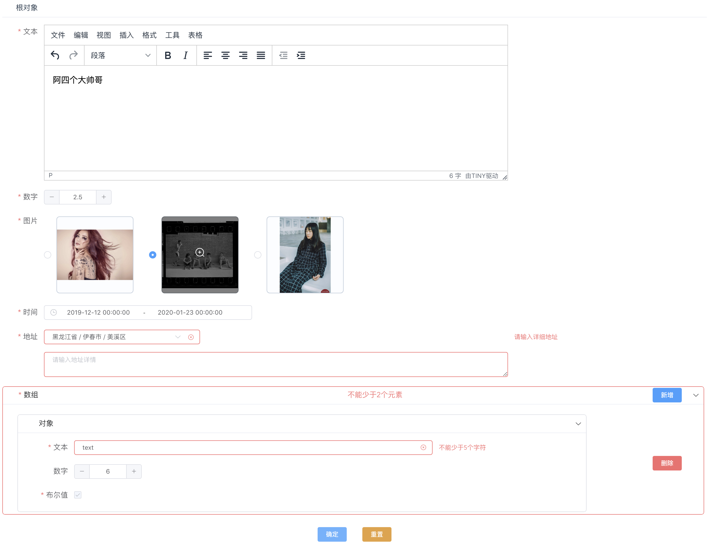

# form

可配置的通用表单组件

* [整体介绍](./docs/README.md)
* [快速开始](./docs/start.md)
* [schema配置](./docs/schema.md)
* [自定义组件](./docs/component.md)
* [playground](http://vui.vivo.xyz:9002)
* 衍生的其他组件：[List](./docs/component/list/index.md)

