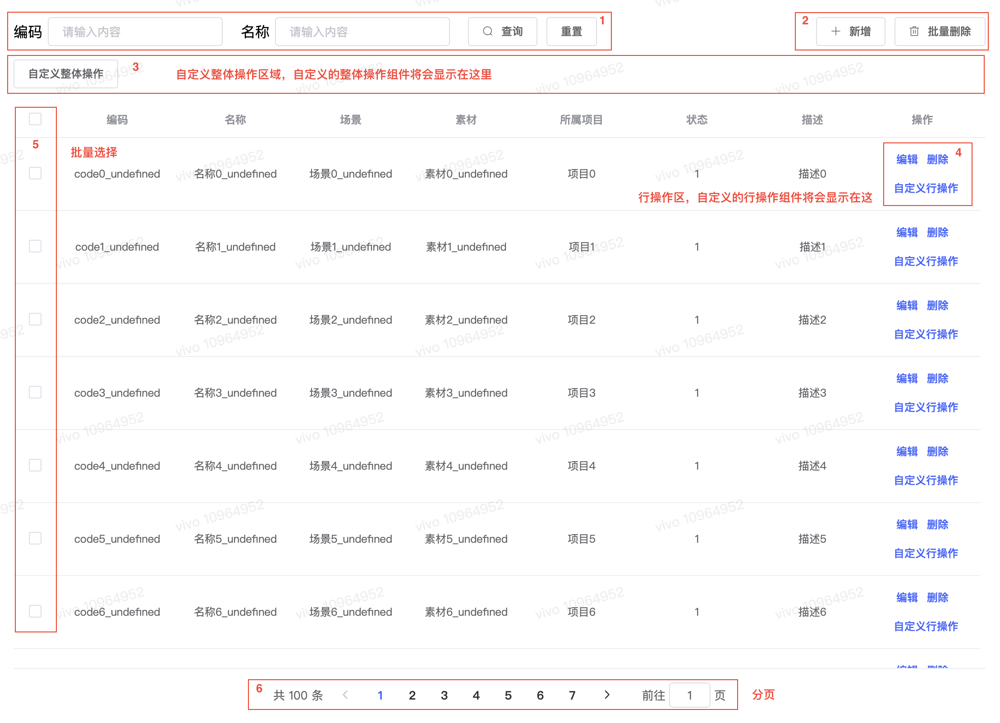

# List组件

> List组件是后台管理页面常见的crud列表组件，形式如下

- 区域1：条件查询区域
- 区域2：新增、批量删除按钮区域
- 区域3：有时候可能需要自定义一些针对整个列表数据进行处理的操作，这个自定义的操作组件就显示在该区域中
- 区域4：该区域显示一些针对单行数据进行处理的组件，用户也可以自定义处理组件
- 区域5：批量选择区域
- 区域6：有时候数据很多时需要进行分页，该区域显示分页组件

## 用法

## schema

`List`组件接受一个`schema`属性，schema是一个对象，各属性配置如下

|           名称            |    类型    | 必填  | 默认值  |                                                                                                                                                                                                    描述                                                                                                                                                                                                     |
| :-----------------------: | :--------: | :---: | :-----: | :---------------------------------------------------------------------------------------------------------------------------------------------------------------------------------------------------------------------------------------------------------------------------------------------------------------------------------------------------------------------------------------------------------: |
|        properties         |  `Object`  |  `Y`  |   `-`   |                                                                                                                                                              列表元素数据的各属性描述schema，与Form表单各字段的[schema](../../schema.md)一致。                                                                                                                                                              |
|   properties.xx.primary   | `Boolean`  |  `N`  | `false` |                                                                                                                                                              表示xx属性是主键，在`properties`的所有属性中**必须有且只有一个**属性为primary属性                                                                                                                                                              |
| properties.xx.showInTable | `Boolean`  |  `N`  | `true`  |                                                                                                                                                                                  表示列表元素数据的xx属性是否在表格中显示                                                                                                                                                                                   |
|  properties.xx.showInAdd  | `Boolean`  |  `N`  | `false` |                                                                                                                                                                             表示列表元素数据的xx属性是否在新增界面的表单中显示                                                                                                                                                                              |
| properties.xx.showInEdit  | `Boolean`  |  `N`  | `false` |                                                                                                                                                                             表示列表元素数据的xx属性是否在编辑界面的表单中显示                                                                                                                                                                              |
|        pagination         | `Boolean`  |  `N`  | `true`  |                                                                                                                                                                                                  是否分页                                                                                                                                                                                                   |
|         selection         | `Boolean`  |  `N`  | `true`  |                                                                                                                                                                                              是否可以批量选择                                                                                                                                                                                               |
|           query           | `Function` |  `Y`  |   `-`   | 查询数据的函数，该函数接受参数为(search,axios,callback)。search为查询条件对象，如{id:xx,code:xx,page:1}；axios为axios对象，可以直接使用该对象进行ajax请求；callback为数据回调函数，形式为callback(data)，请求成功后需要将数据传入该回调函数。data格式为{total,page,pageSize,list}，total为总页数，page为当前页码，pageSize为一页显示多少数据，list为实际数据列表，当不需要分页时total、page、pageSize可不填 |
|            add            | `Function` |  `N`  |   `-`   |                                                                新增数据的函数，不填时表示不显示默认的新增按钮。该函数接受参数为(value,axios,callback)。value为新增的数据对象，如{id:xx,name:xx,project:xx}；axios为axios对象，可以直接使用该对象进行ajax请求；callback为回调函数，当操作成功时调用`callback()`，否则需要调用`callback(true)`                                                                |
|           edit            | `Function` |  `N`  |   `-`   |                                                                编辑数据的函数，不填时表示不显示默认的行编辑按钮。该函数接受参数为(value,axios,callback)。value为编辑后的行数据对象，如{name:xx,project:xx}；axios为axios对象，可以直接使用该对象进行ajax请求；callback为回调函数，当操作成功时调用`callback()`，否则需要调用`callback(true)`                                                                |
|          delete           | `Function` |  `N`  |   `-`   |                                                             删除数据的函数，不填时表示不显示默认的行删除按钮。该函数接受参数为(value,axios,callback)。value为要删除的行数据对象，如{id:xx,name:xx,project:xx}；axios为axios对象，可以直接使用该对象进行ajax请求；callback为回调函数，当操作成功时调用`callback()`，否则需要调用`callback(true)`                                                             |
|        multiDelete        | `Function` |  `N`  |   `-`   |                                      批量删除数据的函数，不填时表示不显示默认的批量删除按钮。该函数接受参数为(selection,axios,callback)。selection为当前选中的行数据数组，如[{id:xx,name:xx,project:xx},{id:xx,name:xx,project:xx}]；axios为axios对象，可以直接使用该对象进行ajax请求；callback为回调函数，当操作成功时调用`callback()`，否则需要调用`callback(true)`                                       |
|       rowOperations       | `Function` |  `N`  |   `-`   |                              自定义行操作的函数，返回自定义操作的组件数组。这些组件都接受schema、list、index、search、selection、actions这些prop，schema为List组件的schema；list为整个数据列表；index为当前操作行的索引；search为当前的查询条件对象；selection为当前批量选中的行数据数组；actions为List组件暴露出来的可操作方法的对象，目前只暴露了setSearch、query这两个方法                               |
|     actions.setSearch     | `Function` |  `-`  |   `-`   |                                                                                                                                               设置List组件的查询条件，形式为setSearch(search)，search为设置的查询条件对象，当不传入search时，表示重置查询条件                                                                                                                                               |
|       actions.query       | `Function` |  `-`  |   `-`   |                                                                                                                                                                                          以当前的查询条件进行查询                                                                                                                                                                                           |
|     globalOperations      | `Function` |  `N`  |   `-`   |                                                                                                                                                  自定义全局操作的函数，返回自定义操作的组件数组。这些组件接受的props跟rowOperations组件一致，除了没有index                                                                                                                                                  |
|          expand           | `Function` |  `N`  |   `-`   |                                                                                                               定义展开行的函数，返回自定义的[展开行组件](https://element.eleme.io/#/zh-CN/component/table#zhan-kai-xing)。该组件接受的props与rowOperations组件一致，另外还接受slotscope属性。                                                                                                               |
