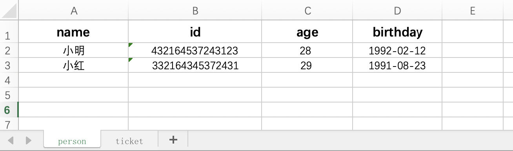
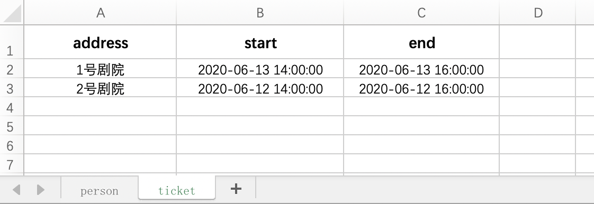

# schema 配置

## 概述

- `schema` 是`Form`组件的必须属性，用于描述表单的基本结构、UI、校验等信息
- `schema`兼容`JSON Schema`规范，并在此基础上新增了一些属性

## 通用属性

|                名称                 |                               类型                               | 必填 | 默认值  |                                                                                                                                                                                                                                                    描述                                                                                                                                                                                                                                                    |
| :---------------------------------: | :--------------------------------------------------------------: | :--: | :-----: | :--------------------------------------------------------------------------------------------------------------------------------------------------------------------------------------------------------------------------------------------------------------------------------------------------------------------------------------------------------------------------------------------------------------------------------------------------------------------------------------------------------: |
|                title                |                             `String`                             | `N`  |   `-`   |                                                                                                                                                                                                                                     表单项的标题信息，作为 label 展示                                                                                                                                                                                                                                      |
|             description             |                             `String`                             | `N`  |   `-`   |                                                                                                                                                                                                                                 表单项的描述信息，常将填写注意点放入此参数                                                                                                                                                                                                                                 |
|                type                 |                             `String`                             | `Y`  |   `-`   |                                                                                                                                                                                    表单项值的类型，支持`string`、`number`、`boolean`、`array`、`object`、`range`、`address`。`range`表示日期时间范围；`address`表示地址                                                                                                                                                                                    |
|                enum                 |                      `Array`&#124;`Object`                       | `N`  |   `-`   | 单选或多选 **(v0.2.2+)** 时的选项值列表，支持所有数据类型，**(v0.2.1- 仅当`type`为`string`、`number`、`boolean`、`range`、`address`时支持)**。单选时默认使用 radio 组件，多选时默认使用 checkbox 组件，都可以通过设置`component`属性为`select`来使用 select 组件。当 enum 为对象类型时 **(v0.2.0+)**，与[List](./component/list/index.md)组件的 schema 一致，表示从接口中获取选项，此时将使用`List`组件为选择列表，**(但只支持`string`、`number`、`boolean`数据类型)**。为数组时表示选项列表是已知的，如下 |
|            enum[{value}]            |               `String`&#124;`Number`&#124;`Array`                | `Y`  |   `-`   |                                                                                                                                                                                                                                                `enum`选项值                                                                                                                                                                                                                                                |
|            enum[{name}]             |                             `String`                             | `N`  |   `-`   |                                                                                                                                                                                                                                               `enum`选项名称                                                                                                                                                                                                                                               |
| enum[{showTip}] **(v0.2.2+已废弃)** |                            `Boolean`                             | `N`  | `false` |                                                                                                                                                                                                                                         `enum`选项是否显示详细提示                                                                                                                                                                                                                                         |
|               default               | `String`&#124;`Number`&#124;`Boolean`&#124;`Array`&#124;`Object` | `N`  |   `-`   |                                                                                                                                                                                                                                               表单项的默认值                                                                                                                                                                                                                                               |
|              validator              |                            `Function`                            | `N`  |   `-`   |                                                                                                                                                              自定义校验函数（优先级最低），该函数接受`(value, callback)`两个参数。`value`为表单项当前的值，如果校验不通过，执行`callback(new Error('提示的错误信息'))`，反之执行`callback()`                                                                                                                                                               |
|              className              |              `String`&#124;`Function`**(v1.1.0+)**               | `N`  |   `-`   |                                                                                                                                             表单项自定义的类名，用来自定义样式。当为函数时 **(v1.1.0+)**，格式为`(path:string, value:any) => string`，path 为当前表单项在整个表单中的位置，如`['propname'][index]`；value 为当前表单项的值，返回值为自定义类名                                                                                                                                             |
|              readonly               |                            `Boolean`                             | `N`  | `false` |                                                                                                                                                                                                                               表单项是否只读，只读时必须设置`default`默认值                                                                                                                                                                                                                                |
|               hidden                |             `Boolean`&#124;`String`&#124;`Function`              | `N`  | `false` |                                                                        该表单项是否隐藏，隐藏时整个表单的值及校验结果会丢弃该字段。`true`表示隐藏，反之不隐藏；为`String`类型时支持表达式，如`data.members[0].id==='22'`表示该表单项在整个表单的`members`字段第一个元素的`id`属性为`22`时隐藏，`data`变量表示整个表单的值，且变量名称不能变；为`Function`时函数接受`(data)`参数，`data`为整个表单当前的值，函数返回值表示是否隐藏。                                                                        |
|              component              |                     `String`&#124;`Function`                     | `N`  |   `-`   |                                                                                                                                                                    `Function`对任何类型的`type`都生效，表示该表单项使用自定义组件，函数须返回自定义的 vue 组件对象；单选、多选时的配置如上`enum`属性描述，其他情况详见下面各类型的详述                                                                                                                                                                     |

## string

`string`类型支持的属性如下

|            名称             |           类型           | 必填 |    默认值    |                                                                                                                                                                             描述                                                                                                                                                                             |
| :-------------------------: | :----------------------: | :--: | :----------: | :----------------------------------------------------------------------------------------------------------------------------------------------------------------------------------------------------------------------------------------------------------------------------------------------------------------------------------------------------------: |
|           format            |         `String`         | `N`  |     `-`      |                                                                                               不设置表示普通输入字符串；`color`表示颜色；`image`表示图片；`video`表示视频；`file`表示普通文件；`time`、`date`、`datetime`、`year`、`month`、`week`表示日期时间                                                                                               |
|         valueFormat         |         `String`         | `N`  |     `-`      |                                                                                                  当 format 为`time`、`date`、`datetime`、`year`、`month`、`week`时必填，详见[日期格式](https://element.eleme.cn/#/zh-CN/component/date-picker#ri-qi-ge-shi)                                                                                                  |
| pickerOptions **(v0.3.0+)** |         `Object`         | `N`  |     `-`      |               当 format 为`time`、`date`、`datetime`、`year`、`month`、`week`时可选填该属性，当为`time`时，详见[element-ui TimePicker Options](https://element.eleme.io/#/zh-CN/component/time-picker#time-picker-options)，其他情况详见[element-ui DatePicker Options](https://element.eleme.io/#/zh-CN/component/date-picker#picker-options)               |
|          minLength          |         `Number`         | `N`  |     `-`      |                                                                                                                                                                           最小长度                                                                                                                                                                           |
|          maxLength          |         `Number`         | `N`  |     `-`      |                                                                                                                                                                           最大长度                                                                                                                                                                           |
|          uploader           |        `Function`        | `N`  |     `-`      | 当`format`未设置且`component`为`richtext`时有效，如果未设置`uploader`会禁止富文本上传文件，设置成函数时可上传文件，接受`(blobInfo, success, fail)`三个参数，`blobInfo`表示文件相关信息（`blobInfo.blob()`获取文件 blob 内容,`blobInfo.filename()`获取文件名），上传成功后需要执行`success(location)`，`location`表示文件上传后的地址，失败后需要执行`fail()` |
|        fileValidator        |        `Function`        | `N`  |     `-`      |                                                                 文件校验函数，当`format`为`image`、`video`、`file`时有效，接受`(file, callback)`参数，`file`为选择的文件对象。若返回`false`或者`Promise`且被`reject`了，则文件不会上传，此时需要调用`callback('校验失败原因')`来显示失败原因                                                                 |
|  onProgress **(v1.2.0+)**   |        `Function`        | `N`  |     `-`      |                                                                                        上传进度回调函数，当`format`为`image`、`video`、`file`时有效。 与[element-ui Upload 组件](https://element.eleme.io/#/zh-CN/component/upload#attribute)的`on-progress`属性一致                                                                                         |
| progressWidth **(v1.2.0+)** |         `Number`         | `N`  |     `-`      |                                                                                                                                                                    默认的上传进度条的宽度                                                                                                                                                                    |
|    maxSize **(v1.2.0+)**    |         `Number`         | `N`  |     `-`      |                                                                                                                                                                      限制上传资源的大小                                                                                                                                                                      |
|   maxWidth **(v1.2.0+)**    |         `Number`         | `N`  |     `-`      |                                                                                                                                                                  上传为图片时限制图片的宽度                                                                                                                                                                  |
|   maxHeight **(v1.2.0+)**   |         `Number`         | `N`  |     `-`      |                                                                                                                                                                  上传为图片时限制图片的高度                                                                                                                                                                  |
|         urlFetcher          | `String`&#124;`Function` | `N`  |     `-`      |                                      提取文件上传后的 url，当`format`为`image`、`video`、`file`时必须。当`urlFetcher`为`String`类型时，支持表达式，如`response.data.url`，`response`变量为服务器响应数据，且变量名称不能变；为`Function`类型时接受`(response)`参数，`response`为服务器响应数据，函数返回值为文件的 url                                       |
|          component          | `String`&#124;`Function` | `N`  |     `-`      |                                                                                                                `format`未设置时默认使用`input`组件，当`component`为`textarea`时使用`textarea`组件；当`component`为`richtext`时使用富文本组件                                                                                                                 |
|  placeholder **(v1.2.0+)**  |         `String`         | `N`  | `请输入内容` |                                                                                                                                                  当`format`未设置且`component`为 input 或者 textarea 时生效                                                                                                                                                  |

> 当`format`为`color`时，还支持`showAlpha`、`colorFormat`、`predefine`属性，与`element-ui`的[ColorPicker](https://element.eleme.cn/#/zh-CN/component/color-picker)组件一致

> 当`format`为`image`、`video`、`file`时，还支持`action`、`name`、`headers`、`withCredentials`、`data` **(v1.0.1+)** 和`accept`属性，与`element-ui`的[Upload](https://element.eleme.cn/#/zh-CN/component/upload)组件一致

```
{
  title: '普通文本',
  type: 'string',
  minLength: 5,
  maxLength: 25,
  default: 'a text'
}

{
  title: '单选文本',
  type: 'string',
  enum: ['text1', 'text2', 'text3'],
  enumNames: ['文本1', '文本2', '文本3']
}

{
  title: '颜色',
  type: 'string',
  format: 'color',
  default: '#1e90ff|rgba(19, 206, 102)|rgba(19, 206, 102, 0.39)'
}

{
  title: '图片',
  type: 'string',
  format: 'image',
  action: 'http://xxxx'
  default: 'http://xxxxx'
}

{
  title: '视频',
  type: 'string',
  format: 'video',
  default: 'http://xxx1',
  enum: ['http://xxx1', 'http://xxx2', 'http://xxx3']
}
```

## number

`number`类型支持的属性如下

|    名称    |   类型   | 必填 | 默认值 |                    描述                    |
| :--------: | :------: | :--: | :----: | :----------------------------------------: |
|  minimum   | `Number` | `N`  |  `-`   |                   最小值                   |
|  maximum   | `Number` | `N`  |  `-`   |                   最大值                   |
| multipleOf | `Number` | `N`  |  `-`   | 设置后该表单项的值必须是`multipleOf`的倍数 |

```
{
  title: '数字',
  type: 'number',
  minimum: 5,
  minimum: 25,
  multipleOf: 5,
  default: 10
}

{
  title: '数字',
  type: 'number',
  enum: [5, 10, 15],
  enumNames: ['数字1', '数字2', '数字3']
}
```

## boolean

`boolean`类型支持的属性如下

|   名称    |           类型           | 必填 | 默认值 |                                    描述                                     |
| :-------: | :----------------------: | :--: | :----: | :-------------------------------------------------------------------------: |
| component | `String`&#124;`Function` | `N`  |  `-`   | 默认使用`checkbox`组件，将`component`设置成`switch`，此时将使用`switch`组件 |

## array

`array`类型支持的属性如下

|        名称        |                      类型                      | 必填 | 默认值  |                                                                                                                              描述                                                                                                                              |
| :----------------: | :--------------------------------------------: | :--: | :-----: | :------------------------------------------------------------------------------------------------------------------------------------------------------------------------------------------------------------------------------------------------------------: |
|       items        |                    `Object`                    | `Y`  |   `-`   |                                                                                                                       每个子项的 schema                                                                                                                        |
|      minItems      |                    `Number`                    | `N`  |   `0`   |                                                                                                                        最少有多少个元素                                                                                                                        |
|      maxItems      |                    `Number`                    | `N`  |   `-`   |                                                                                                                        最多有多少个元素                                                                                                                        |
|    uniqueItems     | `Boolean`&#124;`Array<String>`&#124;`Function` | `N`  | `false` | 数组的元素是否允许重复。`false`表示允许重复（元素完全一致算作重复），反之不允许重复；`Function`表示自定义函数，接受`(item)`参数，`item`为子元素的值，返回唯一性计算的字符串；当子项为`object`时，支持属性数组。如`['id','num']`表示`id`和`num`属性不能同时一致 |
| enum **(v0.2.2+)** |             `Array`&#124;`Object`              | `N`  |   `-`   |                                                                                            `enum`在数组类型中表示多选，其他场景均为单选，详见[通用属性](#通用属性)                                                                                             |

```
{
  title: '对象数组',
  type: 'array',
  minItems: 1,
  maxItems: 3,
  uniqueItems: ['name'],
  items: {
    type: 'object',
    properties: {
      name: {
        title: '名称',
        type: 'string'
      },
      tickets: {
        title: '门票数',
        type: 'number'
      }
    }
  }
}
```

## object

`object`类型支持的属性如下

|         名称         |      类型       | 必填 | 默认值 |                                                       描述                                                        |
| :------------------: | :-------------: | :--: | :----: | :---------------------------------------------------------------------------------------------------------------: |
|      properties      |    `Object`     | `Y`  |  `-`   |                                                描述各属性的 schema                                                |
|       required       | `Array<String>` | `N`  |  `-`   |                                                必须属性名称的数组                                                 |
| format **(v0.2.1+)** |    `String`     | `N`  |  `-`   | 可以设置成`excel`，表示从 excel 文件中导入数据，excel 文件的内容必须要遵守规范，[详见](#excel导入数据（v0.2.1+）) |

```
{
  title: '对象',
  type: 'object',
  required: ['id', 'name'],
  properties: {
    id: {
      title: 'id',
      type: 'string'
    },
    name: {
      title: '名称',
      type: 'string'
    },
    tickets: {
      title: '门票数',
      type: 'number',
      default: 0
    }
  }
}
```

## range

`range`类型的值是长度为 2 的字符串数组，支持的属性如下

|            名称             |   类型   | 必填 |   默认值   |                                                                                                                                                             描述                                                                                                                                                              |
| :-------------------------: | :------: | :--: | :--------: | :---------------------------------------------------------------------------------------------------------------------------------------------------------------------------------------------------------------------------------------------------------------------------------------------------------------------------: |
|           format            | `String` | `N`  | `datetime` | 时间类型，`time`表示[时间](https://element.eleme.cn/#/zh-CN/component/time-picker)；`datetime`表示[日期时间](https://element.eleme.cn/#/zh-CN/component/datetime-picker)；`date`表示[日期](https://element.eleme.cn/#/zh-CN/component/date-picker)；`month`表示[月份](https://element.eleme.cn/#/zh-CN/component/date-picker) |
|         valueFormat         | `String` | `Y`  |    `-`     |                                                                                                    表单项值的格式，与`format`配合使用，详见[日期格式](https://element.eleme.cn/#/zh-CN/component/date-picker#ri-qi-ge-shi)                                                                                                    |
| pickerOptions **(v0.3.0+)** | `Object` | `N`  |    `-`     |                                                                                                                                             同上`string`类型的`pickerOptions`属性                                                                                                                                             |

```
{
  title: '时间范围',
  type: 'range',
  format: 'time',
  valueFormat: 'HH:mm:ss',
  default: ['07:30:45', '11:30:45']
}

{
  title: '日期时间范围',
  type: 'range',
  format: 'datetime',
  valueFormat: 'yyyy-MM-dd HH:mm:ss',
  default: ['2019-12-12 11:30:45', '2019-12-22 11:30:45']
}

{
  title: '日期范围',
  type: 'range',
  format: 'date',
  valueFormat: 'yyyy-MM-dd',
  default: ['2019-12-12', '2019-12-22']
}

{
  title: '月份范围',
  type: 'range',
  format: 'month',
  valueFormat: 'MM',
  default: ['6', '11']
}
```

## address

`address`类型的值是长度为 1-4 的字符串数组，支持的属性如下

|   名称    |    类型    | 必填 |  默认值  |                                                                                                                                                                                                                     描述                                                                                                                                                                                                                     |
| :-------: | :--------: | :--: | :------: | :------------------------------------------------------------------------------------------------------------------------------------------------------------------------------------------------------------------------------------------------------------------------------------------------------------------------------------------------------------------------------------------------------------------------------------------: |
|  format   |  `String`  | `N`  | `detail` |                                                                                                                                                              表示地址定位到哪个级别，`province`只包含省份；`city`包含省份和城市；`area`包含省市区；`detail`包含省市区和地址详情                                                                                                                                                              |
|  fetcher  | `Function` | `N`  |   `-`    | 获取省市区列表的方法，接受`(callback)`参数，获取成功后调用`callback(address)`来传入省市区信息。`address`变量表示省市区列表，格式与`element-ui`的[Cascader](https://element.eleme.cn/#/zh-CN/component/cascader)组件的`options`选项一致。当未设置`fetcher`时，默认使用[账户平台化](<http://km.vivo.xyz/pages/viewpage.action?pageId=28480544&token=iIVODW0BekNrSG24IShFFAPeCr-VGp1yiRcjgZ7A(55d5FVXb99gFoBWGWVPMHbN2gXyu57Ha0s)>)的省市区信息 |
|  filter   | `Boolean`  | `N`  |  `true`  |                                                                                                                                                                                    当使用账户平台化的省市区信息时有效，`true`表示过滤特殊地区，反之不过滤                                                                                                                                                                                    |
| minLength |  `Number`  | `N`  |   `0`    |                                                                                                                                                                                           当`format`为`detail`时生效，表示地址详情最少支持多少字符                                                                                                                                                                                           |
| maxLength |  `Number`  | `N`  |   `-`    |                                                                                                                                                                        当`format`为`detail`时生效，表示地址详情最多支持多少字符，此时地址详情输入框会有输入字符数提示                                                                                                                                                                        |

```
{
  title: '地址',
  type: 'address',
  format: 'detail',
  minLength: 5,
  maxLength: 100,
  default: ['浙江省', '杭州市', '余杭区', '奥克斯创智1号']
}
```

## excel 导入数据（v0.2.1+）

有时候需要输入的数据量太大，通过表单来一个个输入很麻烦，而且页面性能也很差，所以也支持通过 excel 文件来导入数据。不过 excel 导入数据时只支持默认的数据格式。示例如下

表单项 schema

```javascript
{
  title: 'excel',
  type: 'object', // 必须设置为object
  format: 'excel', // 必须设置为excel
  required: ['person', 'ticket'],
  properties: {
    person: {
      type: 'array', // 必须设置为array
      minItems: 1,
      maxItems: 10,
      items: {
        type: 'object', // 必须设置为object
        required: ['name', 'id', 'age', 'birthday'],
        properties: {
          name: {
            type: 'string' // 只能设置为string或number
          },
          id: {
            type: 'string'
          },
          age: {
            type: 'number'
          },
          birthday: {
            type: 'string'
          }
        }
      }
    },
    ticket: {
      type: 'array',
      items: {
        type: 'object',
        properties: {
          address: {
            type: 'string'
          },
          start: {
            type: 'string'
          },
          end: {
            type: 'string'
          }
        }
      }
    }
  }
}
```

表单项值

```json
{
  "person": [
    {
      "name": "小明",
      "id": "432164537243123",
      "age": 28,
      "birthday": "1992-02-12"
    },
    {
      "name": "小红",
      "id": "332164345372431",
      "age": 29,
      "birthday": "1991-08-23"
    }
  ],
  "ticket": [
    {
      "address": "1号剧院",
      "start": "2020-6-13 14:00:00",
      "end": "2020-6-13 16:00:00"
    },
    {
      "address": "2号剧院",
      "start": "2020-6-12 14:00:00",
      "end": "2020-6-12 16:00:00"
    }
  ]
}
```

对应的 excel 文件如下，**每个单元格的数据类型只能为字符串和数字**



